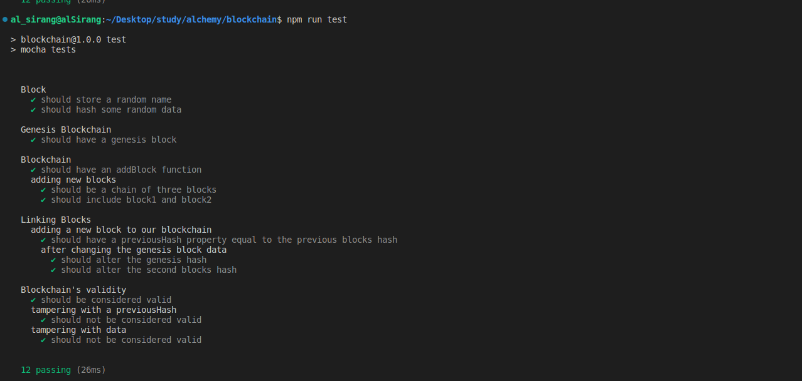

# Build a Blockchain

This challenge is part of [Alchemy University](https://university.alchemy.com)'s Ethereum Developer Bootcamp.

## Goal

Implement a basic blockchain and learn about blocks, hashes and how blocks are linked together to create a cryptographically secure blockchain construct!

## Available Scripts

- Type `npm install` to install required packages
- Type `npm run test` to run tests

## Test Results

